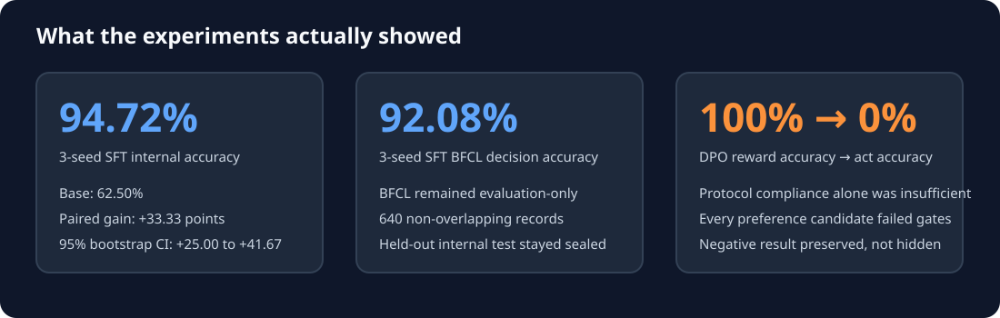
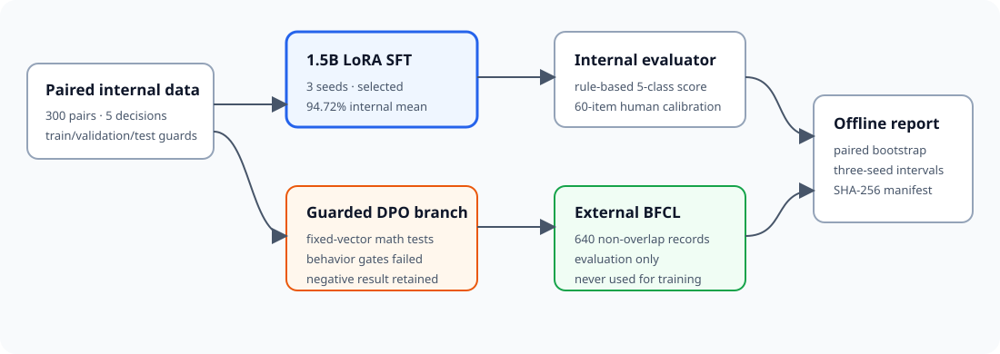

# Tool Abstention

**A reproducible small-model post-training system for deciding when an agent should—and should not—call a tool.**



Tool-use benchmarks usually score whether a model selected the correct function.
This project studies the preceding decision: whether any visible function should be
called. The system distinguishes five behaviors: `CALL`, `ANSWER`, `CLARIFY`,
`REFUSE`, and `NOOP`.

The repository contains the complete engineering path: strict data contracts,
paired synthetic tasks, deterministic evaluation, human evaluator calibration,
MLX LoRA training, a project-owned DPO implementation, external BFCL evaluation,
statistical analysis, and content-hashed artifacts.

## Results

| Evidence | Result |
|---|---:|
| Base model, internal validation | 62.50% |
| 1.5B SFT, internal accuracy (3-seed mean ± sample SD) | **94.72% ± 0.96%** |
| SFT seed-0 improvement over base, paired bootstrap 95% CI | **+33.33 points [25.00, 41.67]** |
| 1.5B SFT, BFCL decision accuracy (3-seed mean) | **92.08%** |
| Evaluator calibration | **60/60** owner-verified items agreed |
| Engineering gate | **210 tests**, strict mypy, Ruff, **95.10% coverage** |

Supervised fine-tuning produced the selected model family. Preference optimization
did not: the numerically verified 1.5B DPO run reached 100% preference reward
accuracy while free-generation act accuracy collapsed to 0%. Every DPO candidate
failed a predeclared behavioral gate and was rejected. This disconnect between
optimization metrics and agent behavior is the central negative result.

Protocol correctness was also insufficient by itself. Several rejected models
retained 100% output-format compliance while making the wrong call-versus-abstain
decision. The evaluator therefore reports semantic behavior and protocol validity
separately.

- [Engineering article](docs/engineering-article.md)
- [Final statistical analysis](docs/26-final-analysis.md)
- [Canonical experiment table](reports/final/comparison.md)
- [Machine-readable summary](reports/final/summary.json)

## System



The internal benchmark contains 300 controlled act/abstain pairs across
productivity, finance, and weather/geography. Each pair changes one capability
condition while preserving the task intent. Labels and expected behavior are
defined by construction and validated with strict Pydantic and JSON Schema
contracts.

Evaluation is deterministic and replayable from stored outputs. It validates tool
syntax and arguments, scores the five behavior classes, reports paired accuracy
and hallucination rates, and separates semantic correctness from protocol
correctness. A blinded 60-item human audit calibrated these rules.

The external evaluation uses a pinned, non-overlapping BFCL slice of 400 CALL and
240 ABSTAIN records. Public benchmarks were evaluation-only and never influenced
training, checkpoint selection, or retries. AgentAbstain is provenance-cataloged in
its native multi-turn format but not forced into this single-turn harness.

## Reproduce and verify

Python 3.12 and [`uv`](https://docs.astral.sh/uv/) are required. The public release
can be verified without a GPU, network connection, model download, or credentials:

```bash
uv sync --locked
make release
```

This command rebuilds the canonical analysis, runs formatting, lint, strict type
checking, and all tests, then verifies SHA-256 hashes for five generated report
artifacts and 30 source evaluation files.

Useful CPU-only commands:

```bash
make check
make analysis
uv run tool-abstention release-audit --root .
uv run tool-abstention --help
```

Model training and inference require Apple Silicon and the optional inference
dependencies:

```bash
uv sync --locked --group inference
make sft-data
make sft-train
make sft-validation
```

Generated datasets, model weights, adapters, caches, and credentials are ignored.
Committed metrics, evaluations, manifests, configs, and compact raw predictions
make the reported experiments auditable without shipping checkpoints.

## Repository map

```text
src/tool_abstention/   contracts, generators, training, inference, evaluation
configs/               exact data, model, training, and analysis configurations
tests/                 numerical, contract, leakage, evaluator, and CLI tests
calibration/           blinded human evaluator-calibration artifacts
results/               stored experiment outputs and manifests
reports/final/         deterministic comparison, statistics, plots, and hashes
docs/                  engineering article, provenance, experiments, final analysis
```

## Implemented stack

- Pinned 4-bit Qwen2.5 1.5B primary and 0.5B screening models
- MLX-LM LoRA SFT on a 24 GB Apple-Silicon laptop
- Project-owned, frozen-reference, completion-only MLX DPO
- Pydantic, JSON Schema Draft 2020-12, NumPy, PyYAML
- `uv`, Ruff, strict mypy, pytest, coverage, GitHub Actions
- Canonical UTF-8 JSON/JSONL and SHA-256 provenance manifests

## Research boundaries

- The internal corpus is synthetic and templated; external validity is limited.
- BFCL evaluation scores CALL-versus-ABSTAIN behavior here, not exact arguments.
- Three SFT seeds expose instability but yield wide exploratory intervals.
- The held-out internal test split remains sealed; all reported internal numbers are
  validation results.
- No claim is made that DPO generally fails—only that the tested objectives and
  data failed their behavioral gates for this model and setting.

## Documentation

Start with the [engineering article](docs/engineering-article.md), then consult the
[final analysis](docs/26-final-analysis.md). Detailed experiment reports
(`docs/12`–`docs/25`) preserve provenance and negative results. External source
licenses and immutable revisions are documented in
[external-data.md](docs/13-external-data.md).

## License

Code and original documentation are Apache-2.0. Third-party datasets retain their
own licenses; BFCL is Apache-2.0 and AgentAbstain data is CC BY 4.0. See the
[external-data documentation](docs/13-external-data.md) for attribution and pinned
revisions.
